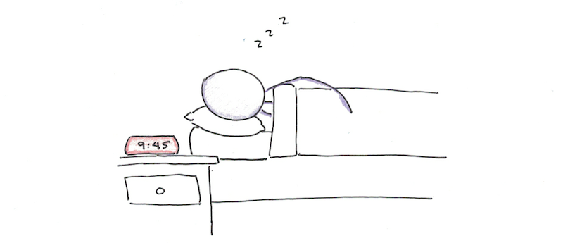
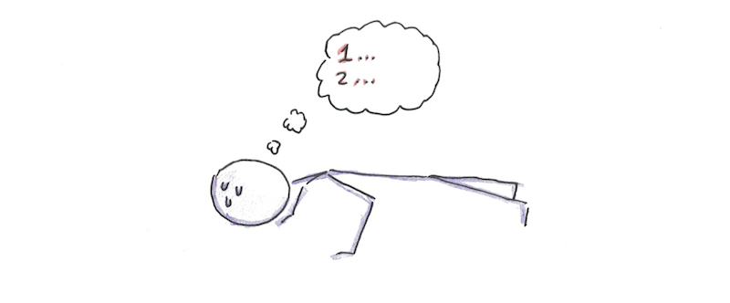
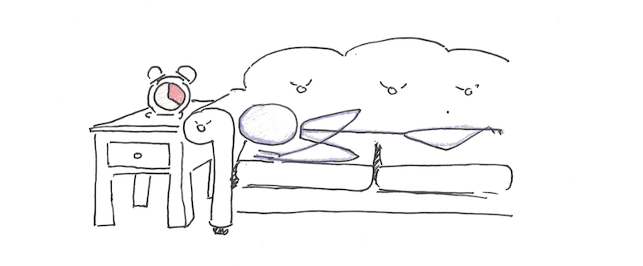
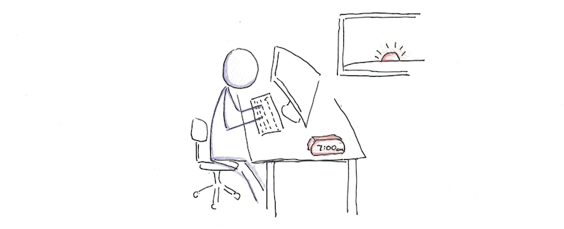
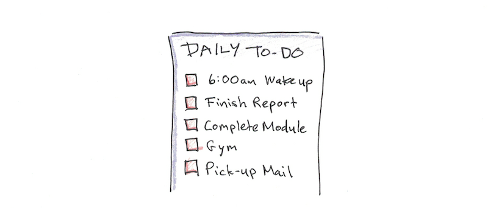
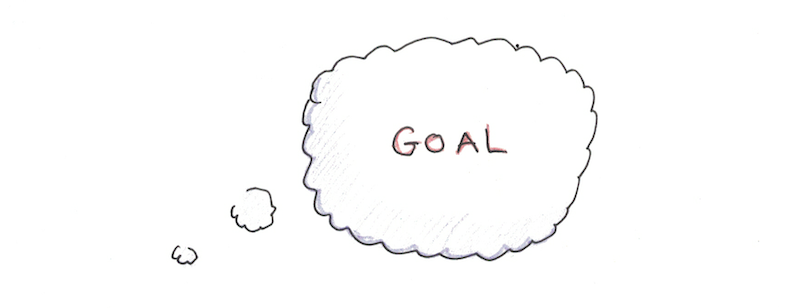
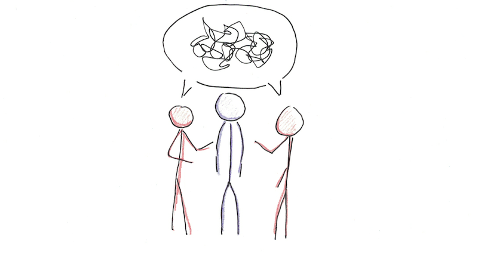
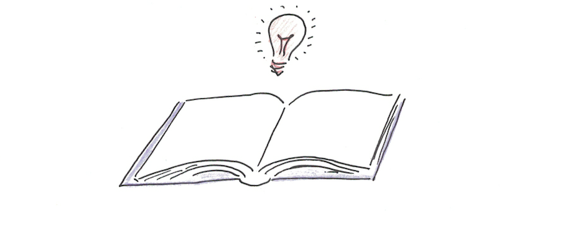
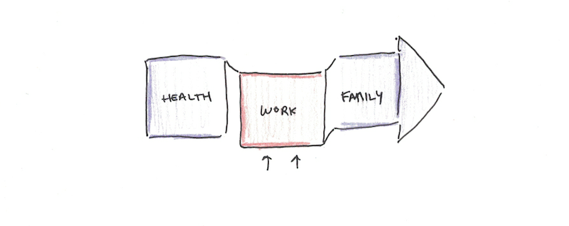

L’energia, non il tempo, è la base della produttività.  Le tue abitudini definiscono i tuoi livelli di energia. Se hai buone abitudini, ti sentirai energico e sarai più resistente, sia fisicamente che mentalmente.

## VAI A DORMIRE PRESTO

Il sonno è il fondamento dell’energia.  Le sette-otto ore sono praticamente obbligatorie per rimanere cognitivo a lungo termine. La privazione del sonno causa continui cali delle prestazioni mentali.
---- 
## ALLENATI TUTTI I GIORNI

L’esercizio fisico è un investimento a lungo termine nei livelli di energia.  Se fai fatica a trovare il tempo per l’esercizio, non fare della palestra il tuo prerequisito. Prendi l’abitudine di fare flessioni o burpees ogni giorno anche a casa. Questi faranno battere il tuo cuore e muoveranno il sangue, e non avranno bisogno di troppo tempo.
---- 
## VENTI MINUTI DI RIPOSO

Il pisolino ha una serie di benefici cognitivi, in modo particolare se si sta apprendendo molto, dal momento che il breve riposo può aiutare la memoria. La chiave è imparare a fare brevi pisolini, non spingendoli in fasi più profonde del sonno che fanno sentire ancora più rigidi al risveglio. 
---- 
## FAI I LAVORI PIU’ IMPEGNATIVI AL MATTINO

I benefici per la tua energia in questo caso sono principalmente psicologici. I livelli di energia dipendono molto dall’ umore. L’altra ragione di questo approccio è che il lavoro profondo non è sempre sostenibile per l’intera giornata lavorativa. Meglio concentrarlo in un periodo specifico piuttosto che inserirlo casualmente in blocchi di tempo.
---- 
## STABILISCI I COMPITI IL GIORNO PRIMA

L’energia è spesso legata allo slancio. Iniziare a lavorare sodo farà in modo di superare la procrastinazione e renderti produttivo per tutta la giornata.  E’ necessario, quindi, stabilire un’intenzione molto chiara su come andrà la giornata, in particolare all’inizio, la sera prima. 
---- 
## STABILISCI GLI OBIETTIVI

Il modo in cui inquadrate i vostri obiettivi e progetti può avere un impatto enorme sulla vostra motivazione.  E’ poi importante il ricordare a sé stessi le proprie aspirazioni. Perché hai iniziato su questa strada? Cosa speravi di ottenere? I bravi esperti di marketing sanno focalizzare il cliente sulla visualizzazione di ciò che vogliono ottenere. Concentrarsi sull’obiettivo aiuta a trovare l’energia necessaria per raggiungerlo.
---- 
## CIRCONDATI DI BUONI AMICI

Non è necessario escludere gli amici che stanno attraversando periodi temporaneamente difficili, ma dovresti considerare con chi trascorri il tuo tempo quando ci sono persone che creano costantemente scambi emotivi unilaterali come base per le tue relazioni. Tutti hanno bisogno di una spalla su cui piangere a volte, ma alcune persone si aspettano che tu sia la loro spalla permanente. Il segreto è circondarsi il più possibile di persone che diano un apporto positivo alla tua vita. Confrontarsi con persone positive ti aiuterà ad essere positivo a tua volta.
---- 
## LEGGI BUONI LIBRI

Uno dei grandi vantaggi della lettura non è semplicemente quello di darti idee e informazioni; piuttosto è quello di rafforzare una mentalità che spesso si manifesta a un livello inconscio. I libri migliori non sono quelli che ti insegnano i fatti, ma quelli che cambiano sottilmente i tuoi interi schemi di pensiero. Gli audiolibri possono essere molto utili per questo, poiché puoi ascoltarli e riascoltarli ogni giorno. Un buon libro è quello che, quando lo leggi o lo ascolti, adatta automaticamente il tuo pensiero alle cose su cui devi lavorare. 
---- 
## ALLINEA LA TUA VITA

Si tratta di uno sforzo continuo per allineare i diversi elementi della tua vita. Molta energia viene sprecata perché le diverse parti della nostra vita, sia interne che esterne, sono in conflitto tra loro. Trascorri del tempo a districare i diversi conflitti della tua vita per vedere come risolverli. A volte ciò può essere fatto a breve termine, apportando una modifica. A volte, richiede un piano a lungo termine per sfuggire all’ambiente tossico, alla cerchia sociale o al sistema di credenze che ti trattiene.